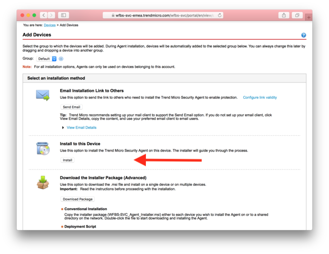
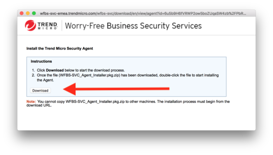
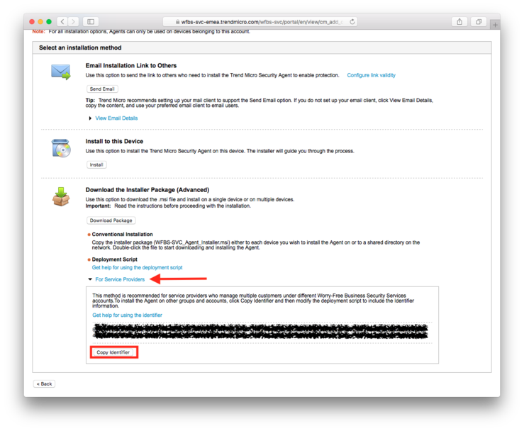

# Deploying TrendMicro Worry-Free Security Services agent
###### a little tutorial to create a trendmicro-installer for macOS deployment - with pkgbuild (of course u can use any other tool)

### Step 1: Downloading Installer Package
1. Go to the [Trend Micro Security Website](https://wfbs-svc-emea.trendmicro.com/) 
2. Click *Device* and choose your Device Group
3. Click *Add Devices* and choose under *Install to this Device* -> Install

4. Next step click *Download* and download the package on your mac.


### Step 2: Creating deploy script "Identifier.plist"
1. Go to the [Trend Micro Security Website](https://wfbs-svc-emea.trendmicro.com/), click on *Device* and choose your Device Group
2. Click *Add Devices* again and choose under *Download the Installer Package (Advanced)* -> *For Service Providers*
3. Get your *Identifier* by clicking on the button *Copy Identifier*

4. Put the *Identifier* in a plist file. Replace "PutYourIdentifier" parameter with your Identifier. (Use my default plist file in the repo)
```plist
<?xml version="1.0" encoding="UTF-8"?>
<!DOCTYPE plist PUBLIC "-//Apple//DTD PLIST 1.0//EN" "http://www.apple.com/DTDs/PropertyList-1.0.dtd">
<plist version="1.0">
<dict>
	<key>Identifier</key>
	<string>#PutYourIdentifier</string>
</dict>
</plist>
```

### Step 3: Distributable package with pkgbuild (macOS inhouse tool)
1. first, we need the following directory tree:
```
e.g. Desktop
      └── TrendMicroAgent
                └── script
                      └── postinstall
    		└── ROOT
        	     └── var
			  └── tmp
				└── TrendMicro
					├── Identifier.plist
					└── WFBS-SVC_Agent_Installer.pkg
```
2. We need the postinstall file. This file ensures that the WFBS-SVC_Agent_Installer.pkg is installed
```shell
#!/bin/sh
## postinstall

installer -pkg /var/tmp/TrendMicro/WFBS-SVC_Agent_Installer.pkg -target /

exit 0		## Success
exit 1		## Failure
```

3. We have the tree and we have also the *postinstall* file, the *WFBS-SVC_Agent_Installer.pkg* and the *Identifier.plist*. Put the files in the appropriate directories. Now, ensures that the right permissions are granted.
```
cd TrendMicroAgent
sudo chown -R root:wheel *
chmod a+x scripts/
```
4. Now run the following command (while you are the TrendMicroAgent directory)
```
pkgbuild --root ROOT/ --identifier de.salihzengin.trendmicro --version 1.0 --nopayload --scripts scripts/ "TrendMicroDeploy.pkg"
```
(of course, you could sign your package with `--sign`)

A few seconds later, you get the following output:
```
pkgbuild: Adding top-level postinstall script
pkgbuild: Wrote package to TrendMicroDeploy.pkg
```
You are done! Finally you can test your package.

*Note*: It could be that the application only starts, if the Mac has been restarted before.
